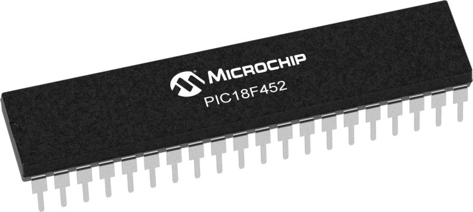
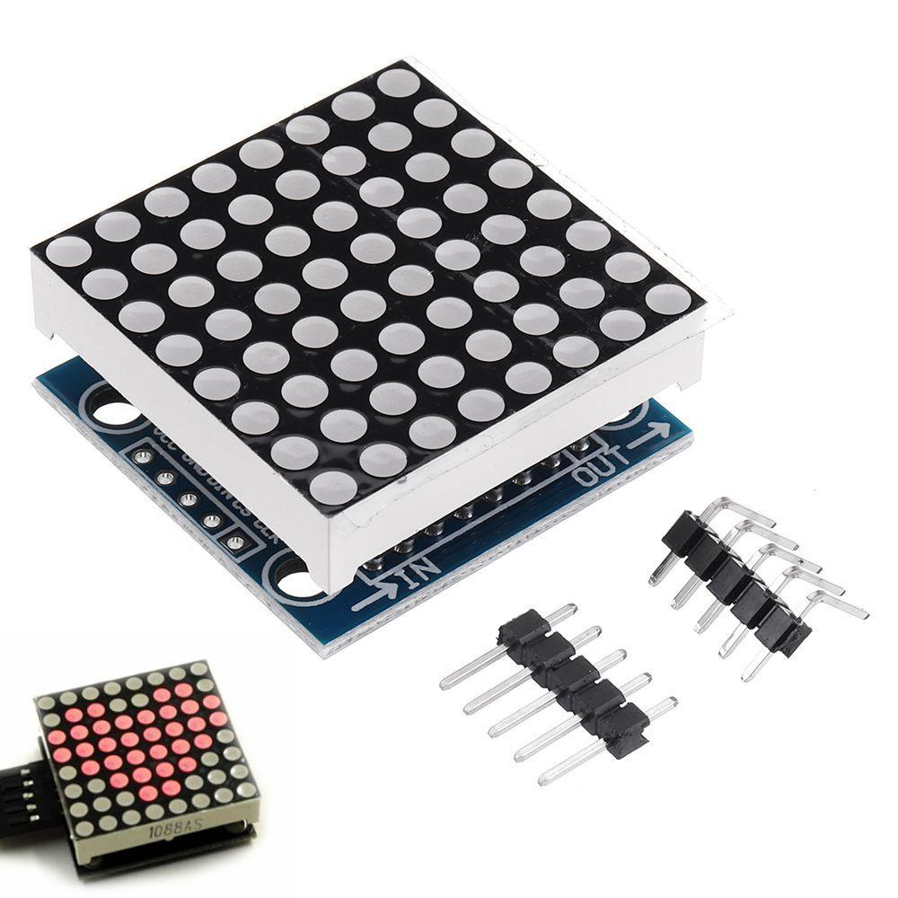
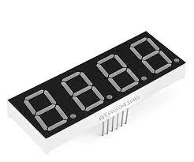
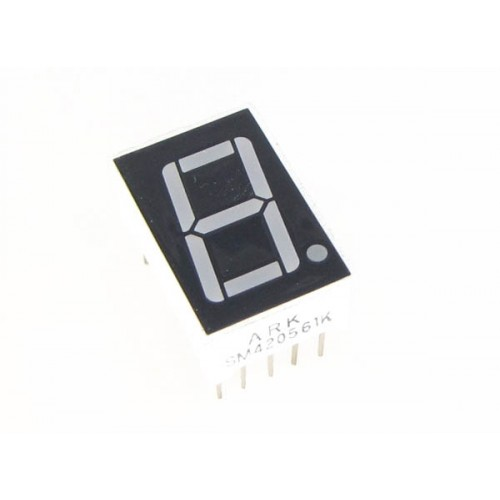

# DotJumper Project

For my final project in an assembly coding class focused on PIC micro-controllers, I decided to create a game called Dot Jumper using an 8x8 dot matrix. Drawing inspiration from popular games like Log Jumpers and [Crossy Road](https://www.crossyroad.com/), Dot Jumper challenges players to navigate through a maze of obstacles without touching them. In this simplified version, players must avoid colliding with lit LEDs that represent logs and skillfully weave their way to the other side. Your position in the game is indicated by a single LED, and if you come into contact with a log, the level resets.

## Details
Here are some extra details for the project:
### Components and Their Connections
- PIC 18F452 Micro-controller
  - Micro-controller that is running the game.

- MAX7219 8x8 Dot Matrix Display Module
  - Connects to the PIC using SPI Communication Protocol.  The Dot Matrix takes the row as the address, and then the data represents the columns of the specific rows. 

- Analog Joystick Module
  - Connects to the PIC 10-bit ADC.  Since the game doesn't need variable input, the program just checks to see if the joystick is pass a threshold value to move the player. 

- 7-Segment Display Modules
  - Uses a 4-Digit and a 1-Digit Module
  - Segments share the same data bus, Anodes are cycled by the PIC internal timer to display different values on different digits without using excess data lines. 

### Game Details
- Logs are represented by lit leds in rows 2-7
- Logs rotate on each row
- Player starts in row 1, represented by a single led
  - Player can move up, down, left, and right withing the 8x8 bounds using the analog joystick
  - Collision with a "log" will reset the level
  - Level is won by reaching row 8
- 10 Levels have been programmed with increasing difficulty (i.e. increase log row or speed or rotation)
  - Celebration animation on dot matrix after 10th level
- Press down on joystick to activate the game, press down while player to end playing
- 7-segment display shows the level and extra information

## Issues
- Collision can be missed if the player moves at the right moment.
  - Fixable by better code ordering/planning.
- Tricky to play on this dot matrix, as it sometimes tricks the eyes on what direction the logs are rotating.
  - Could be improved by a better display or one that's multicolored.
